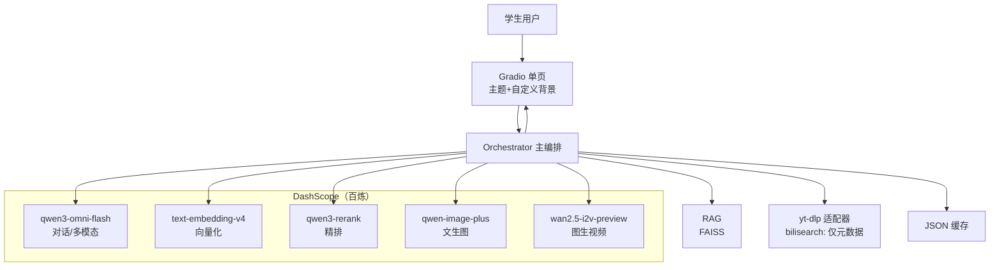
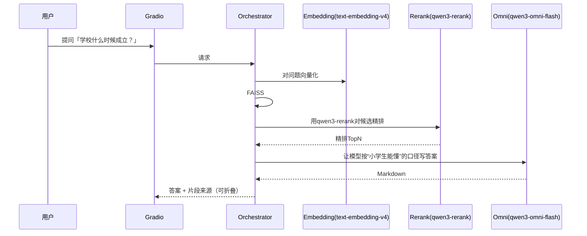
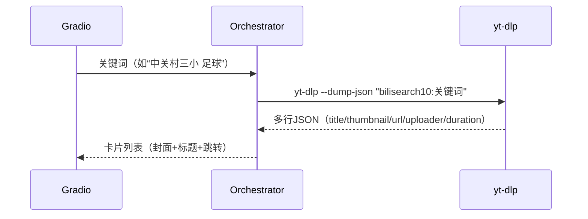
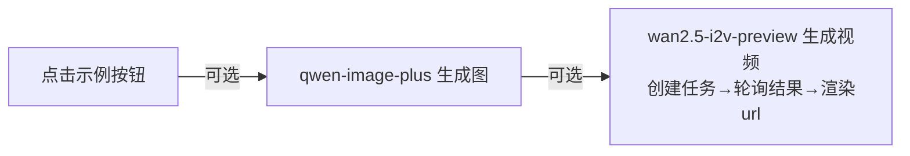
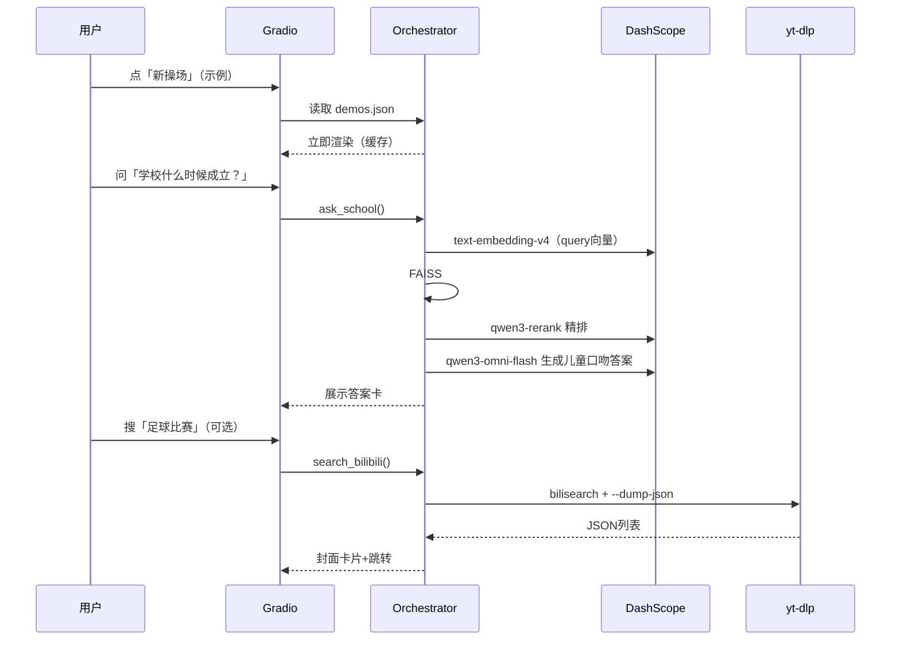

# zgc3-ai-assistant

## 一、需求清单

- **平台与环境**
  - Windows 10 + Miniconda，**CPU-only**。
  - 仅需**DashScope API Key**；**不装本地大模型**、不配代理、不做复杂服务编排。
- **模型（全部走百炼）**
  - 主对话/多模态理解：**`qwen3-omni-flash`**。([Alibaba Cloud](https://www.alibabacloud.com/help/zh/model-studio/qwen-api-reference?utm_source=chatgpt.com))
  - 文生图：**`qwen-image-plus`**（官方文档示例直接用这个 model 参数）。([Alibaba Cloud Help Center](https://help.aliyun.com/zh/model-studio/text-to-image?utm_source=chatgpt.com))
  - 图生视频：**`wan2.5-i2v-preview`**（异步提交+轮询结果）。([Alibaba Cloud](https://www.alibabacloud.com/help/en/model-studio/image-to-video-api-reference?utm_source=chatgpt.com))
  - 向量化：**`text-embedding-v4`**（OpenAI 兼容或 DashScope SDK 均可）。([Alibaba Cloud Help Center](https://help.aliyun.com/zh/model-studio/embedding))
  - 精排：**`qwen3-rerank`** 用于 RAG 二次排序。([Alibaba Cloud Help Center](https://help.aliyun.com/zh/model-studio/text-rerank-api))
- **联网检索**
  - **`yt-dlp`**：只用来**搜 B 站**视频并取**封面/标题/链接**（**不下载视频**）。用 `bilisearch:` 伪 URL + `--dump-json` 拿 JSON 元数据。若 Windows 上装不顺手，**整块功能可一键关闭**。([Seedance](https://seedance.io/ai-models/wan-2-5?utm_source=chatgpt.com))
  - `yt-dlp` 在 Windows 上可用 **pip 安装或下载单文件 exe**，步骤简单。([GitHub](https://github.com/yt-dlp/yt-dlp/wiki/Installation?utm_source=chatgpt.com))
- **界面与体验**
  - **Gradio 单页 UI** + 自定义 CSS 背景（重视“看着高级”）；官方支持主题与自定义 CSS。([gradio.app](https://www.gradio.app/guides/theming-guide?utm_source=chatgpt.com))
  - 首页放 3 个**示例任务**按钮（直接读缓存，**秒出**），避免现场等待与扣费。

------

## 二、技术栈

| 类别     | 选型                       | 说明                                                                                                                                                 |
| -------- | -------------------------- | ---------------------------------------------------------------------------------------------------------------------------------------------------- |
| UI       | **Gradio** + 内联/文件 CSS | 主题 `gr.themes.Glass()` + 自定义背景图，卡片式展示结果。([gradio.app](https://www.gradio.app/docs/gradio/themes?utm_source=chatgpt.com))            |
| LLM 网关 | **DashScope SDK**（官方）  | 一个客户端同时调用 omni、image、i2v、embedding、rerank。([GitHub](https://github.com/dashscope/dashscope-sdk-python?utm_source=chatgpt.com))         |
| RAG      | **FAISS**                  | 用 `text-embedding-v4` 结果做FAISS向量库检索。([Alibaba Cloud Help Center](https://help.aliyun.com/zh/model-studio/embedding))                       |
| 精排     | **qwen3-rerank**           | TopK 候选再精排，提高命中段落相关性。([Alibaba Cloud Help Center](https://help.aliyun.com/zh/model-studio/text-rerank-api))                          |
| 在线检索 | **yt-dlp**                 | `bilisearch:` → JSON 元数据，封面/标题/URL。([Seedance](https://seedance.io/ai-models/wan-2-5?utm_source=chatgpt.com))                               |
| 文生图   | **qwen-image-plus**        | 同步/异步均可，文档有示例与固定尺寸说明。([Alibaba Cloud Help Center](https://help.aliyun.com/zh/model-studio/text-to-image?utm_source=chatgpt.com)) |
| 图生视频 | **wan2.5-i2v-preview**     | 标准“创建→轮询”异步流程。([Alibaba Cloud](https://www.alibabacloud.com/help/en/model-studio/image-to-video-api-reference?utm_source=chatgpt.com))    |
| 缓存     | JSON 文件                  | 示例任务与最近查询落地，**断网也能演示**。                                                                                                           |

------

## 三、架构与时序（Mermaid）

### 3.1 顶层架构

### 3.2 “问校史（RAG）→小学生口吻”时序

### 3.3 “搜 B 站→出封面卡片”

### 3.4 “文生图 / 图生视频”（仅按钮触发，默认不走）

------

## 四、最简时序回顾

------

## 五、可复用 GitHub

- DashScope 官方 Python SDK：**`dashscope/dashscope-sdk-python`**（安装与最简示例）。([GitHub](https://github.com/dashscope/dashscope-sdk-python?utm_source=chatgpt.com))
- Qwen3‑Omni 官方仓库（多模态示例/提示词范式）：**`QwenLM/Qwen3-Omni`**。([GitHub](https://github.com/QwenLM/Qwen3-Omni?utm_source=chatgpt.com))
- Qwen‑Image 官方仓库（T2I/编辑示例）：**`QwenLM/Qwen-Image`**。([GitHub](https://github.com/QwenLM/Qwen-Image?utm_source=chatgpt.com))
- `yt-dlp` 官方仓库与安装说明。([GitHub](https://github.com/yt-dlp/yt-dlp?utm_source=chatgpt.com))
- FAISS-CPU。([Github](https://anaconda.org/pytorch/faiss-cpu))
